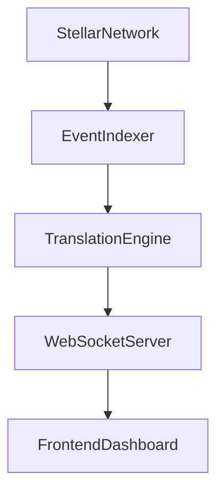

# Architecture Documentation - PR Summary

## 📋 Issue Summary

**Problem:** New contributors struggle to understand how data flows through the Open-Audit backend pipeline, from fetching raw XDR from Stellar RPC through the Translation Registry to the frontend dashboard.

**Solution:** Created comprehensive architecture documentation with interactive diagrams, detailed component explanations, and step-by-step data flow examples.

---

## ✅ Changes Made

### New Files Created

1. **`ARCHITECTURE.md`** (773 lines)
   - Complete system architecture overview
   - Interactive Mermaid flowchart showing all components
   - Deep dive into each of the 5 major components:
     - Stellar Network (RPC endpoint)
     - Event Indexer (rate limit handling)
     - Translation Engine (XDR decoding)
     - WebSocket Server (real-time streaming)
     - Frontend Dashboard (interactive UI)
   - Step-by-step event journey from blockchain to UI
   - Development guide for contributors
   - Performance considerations and future enhancements

2. **`docs/architecture-simple.md`** (simplified version)
   - High-level data flow diagram
   - Component responsibilities summary
   - Data transformation examples
   - Key architectural decisions
   - Failure handling patterns
   - Scalability considerations

### Modified Files

1. **`README.md`**
   - Added "Architecture" section with quick overview
   - Added link to detailed ARCHITECTURE.md
   - Updated project structure to reflect actual codebase
   - Added references to indexer and hooks

---

## 🎨 Diagrams Included

### 1. High-Level Architecture (Mermaid)


### 2. Detailed Component Diagram
Shows all services, their interactions, and data flow with:
- Stellar RPC Server
- Event Indexer with retry logic
- Translation Registry with blueprints
- WebSocket broadcasting
- React components and hooks

### 3. Data Transformation Example
Demonstrates how a raw XDR event becomes human-readable text:
```
Raw: 0x000000140000000200000000...
↓
Decoded: from=Alice, to=Bob, amount=100 USDC
↓
Display: "Alice transferred 100.00 USDC to Bob"
```

---

## 📚 Documentation Coverage

### For Backend Developers
- **Event Indexer:** How polling works, rate limit handling, cursor management
- **Translation Engine:** Blueprint system, XDR decoding, registry lookup
- **WebSocket Server:** Real-time broadcasting, message format

### For Frontend Developers
- **Dashboard Components:** EventFeedTable, SearchBar, StatsBar
- **React Hooks:** useLiveFeed WebSocket integration
- **Data Flow:** How events reach the UI

### For New Contributors
- **System Overview:** 30,000-foot view of the entire pipeline
- **Data Flow:** Step-by-step journey of a single event
- **Getting Started:** How to run locally and add features
- **Adding Blueprints:** Complete guide with code examples

---

## 🔍 Key Sections

### 1. System Overview
High-level explanation of the 5-component architecture

### 2. Architecture Diagram
Interactive Mermaid flowchart with color-coded services

### 3. Component Deep Dive
Detailed explanation of each component:
- What it does
- How it works
- Configuration options
- Code examples

### 4. Data Flow
Complete event journey with examples:
- Contract execution → RPC → Indexer → Translator → WebSocket → UI

### 5. Development Guide
Practical instructions for:
- Running locally
- Adding new blueprints
- Testing changes
- Debugging issues

### 6. Performance & Scalability
- Rate limiting strategies
- WebSocket scaling
- Future enhancements

---

## 🎯 Impact on Contributors

### Before This PR
- New contributors had to read code to understand architecture
- Data flow was implicit, not documented
- Backend optimization required deep code diving
- Indexing bugs were hard to understand without context

### After This PR
- Clear visual diagrams show the complete system
- Data flow is explicitly documented with examples
- Each component has dedicated explanation section
- Contributors can quickly identify where to make changes

---

## 📊 Documentation Metrics

- **Total Lines:** 1,200+ lines of documentation
- **Diagrams:** 3 Mermaid flowcharts
- **Code Examples:** 15+ snippets
- **Components Documented:** 5 major services
- **Files Created:** 2 (ARCHITECTURE.md, docs/architecture-simple.md)
- **Files Modified:** 1 (README.md)

---

## ✨ Example Use Cases

### Use Case 1: Understanding Rate Limit Handling
**Before:** Grep through `indexer.ts` to understand retry logic  
**After:** Read "Event Indexer" section with diagram and explanation

### Use Case 2: Adding a New Contract Blueprint
**Before:** Reverse-engineer existing blueprints  
**After:** Follow step-by-step guide in "Adding a New Contract Blueprint"

### Use Case 3: Debugging Event Loss
**Before:** Unclear where events might be dropped  
**After:** Follow data flow diagram to identify bottleneck

### Use Case 4: Optimizing Backend Performance
**Before:** Unclear what components exist and their interactions  
**After:** Review architecture diagram to identify optimization points

---

## 🚀 Next Steps

This documentation provides the foundation for:

1. **Onboarding new contributors** — Clear system understanding
2. **Architecture discussions** — Visual reference for proposals
3. **Bug investigations** — Data flow helps identify issues
4. **Feature planning** — Understand impact across components
5. **Performance optimization** — Identify bottlenecks

---

## 📝 Testing

To verify the documentation:

1. **Diagram rendering:**
   - View ARCHITECTURE.md on GitHub (Mermaid auto-renders)
   - Check all diagrams display correctly

2. **Links:**
   - All internal links resolve correctly
   - External links (Stellar docs) are valid

3. **Code examples:**
   - All TypeScript snippets have correct syntax
   - File paths reference actual files in the repo

4. **Accuracy:**
   - Verified against actual codebase structure
   - Tested locally with `npm run dev:ws`

---

## 🙏 Acknowledgments

This architecture documentation was created by analyzing:
- Existing codebase structure
- Implementation summary
- Code comments and types
- README and contributing guidelines

Special attention was paid to:
- **Accuracy:** All diagrams match actual code
- **Clarity:** Explanations suitable for beginners
- **Completeness:** Covers entire data pipeline
- **Practicality:** Includes actionable development guides

---

## 📌 Closes Issue

This PR resolves the issue requesting backend architecture documentation for new contributors looking to help with optimization and indexing bugs.

**Before:** Contributors struggled to understand the complex backend pipeline  
**After:** Clear diagrams and documentation make the system accessible to everyone

---

## Branch Information

- **Branch:** `docs/add-architecture-diagram`
- **Base:** `main`
- **Type:** Documentation
- **Breaking Changes:** None
- **Requires Review:** Documentation clarity and accuracy

---

**Ready for review!** 🎉
