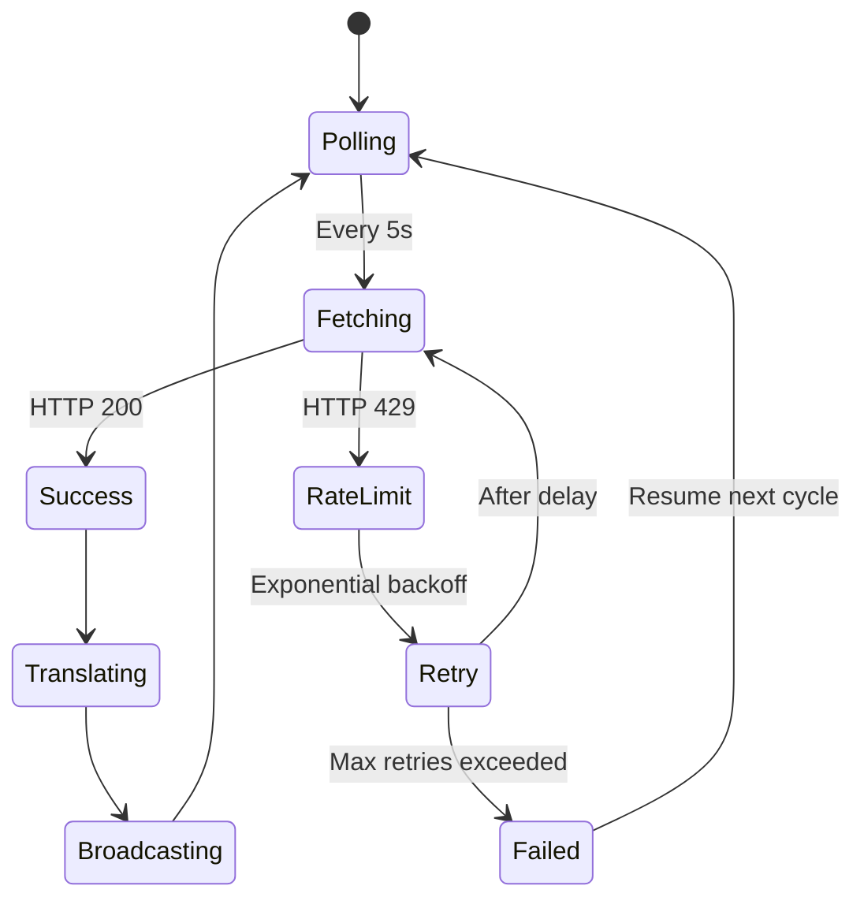

# Open-Audit Architecture - Simplified View

## High-Level Data Flow


## Component Responsibilities

### 🌐 Stellar Network
- **What:** Blockchain where smart contracts live
- **Output:** Raw XDR-encoded events (cryptic hex data)
- **Example:** `0x000000140000000200000000...`

### ⚙️ Event Indexer
- **What:** Continuous polling service with retry logic
- **Input:** RPC endpoint requests
- **Output:** Array of raw events
- **Key Feature:** Exponential backoff on HTTP 429 errors
- **Files:** `lib/stellar/indexer.ts`, `lib/stellar/client.ts`

### 🔄 Translation Engine
- **What:** Converts hex to human-readable text
- **Input:** Raw events with topics + data
- **Output:** Translated events with descriptions
- **Key Feature:** Contract-specific blueprints
- **Files:** `lib/translator/registry.ts`, `lib/translator/blueprints/`

### 📡 WebSocket Server
- **What:** Real-time event broadcasting
- **Input:** Translated events
- **Output:** JSON stream to connected clients
- **Key Feature:** Push-based updates (no polling)
- **Files:** `server.ts`

### 🎨 Frontend Dashboard
- **What:** Interactive web interface
- **Input:** WebSocket event stream
- **Output:** Searchable table with filters
- **Key Feature:** Live updates with animations
- **Files:** `app/dashboard/`, `components/dashboard/`

---

## Data Transformation Example

### Input (Stellar Network)
```json
{
  "contractId": "CDLZFC3SYJYDZT7K67VZ75HPJVIEUVNIXF47ZG2FB2RMQQVU2HHGCYSC",
  "topics": [
    "0x0000000f",
    "0x0000000000000000alice",
    "0x0000000000000000bob"
  ],
  "data": "0x0000000005f5e100"
}
```

### Processing (Translation Engine)
```
1. Lookup contractId → "Stellar Asset Contract (SAC)"
2. Decode topics[1] → "GABC...1234" (Alice)
3. Decode topics[2] → "GXYZ...5678" (Bob)
4. Decode data → "100.00 USDC"
5. Template → "{from} transferred {amount} to {to}"
```

### Output (Frontend Dashboard)
```
┌──────────┬─────────────────────────────────────────────┬───────────┐
│ Transfer │ GABC...1234 transferred 100.00 USDC to     │ Translated│
│          │ GXYZ...5678                                 │           │
└──────────┴─────────────────────────────────────────────┴───────────┘
```

---

## Key Architectural Decisions

### Why Exponential Backoff?
**Problem:** Stellar RPC has rate limits  
**Solution:** Retry with increasing delays (1s → 2s → 4s → 8s...)  
**Result:** Zero event loss during rate limiting

### Why Translation Registry?
**Problem:** Every contract has different event formats  
**Solution:** Pluggable blueprints for each contract  
**Result:** Easy to add new contract support

### Why WebSocket Instead of Polling?
**Problem:** Polling wastes bandwidth and adds latency  
**Solution:** Server pushes events immediately  
**Result:** Real-time updates with minimal overhead

### Why Separate Indexer from Server?
**Problem:** Rate limit handling shouldn't block the web server  
**Solution:** Indexer runs as separate async loop  
**Result:** Web requests stay fast even during RPC issues

---

## Performance Characteristics

| Component | Latency | Throughput | Bottleneck |
|-----------|---------|------------|------------|
| Indexer | ~5s poll interval | ~200 events/poll | RPC rate limits |
| Translator | <1ms per event | 1000+ events/sec | XDR decoding |
| WebSocket | <10ms | 100+ clients | Network bandwidth |
| Frontend | <16ms (60fps) | Unlimited events | Browser rendering |

---

## Failure Handling



**Key Points:**
- Rate limits don't crash the system
- Cursor preserves position during failures
- Failed events are retried automatically
- System self-heals without manual intervention

---

## Scalability Considerations

### Current Architecture (Single Server)
```
┌─────────────┐
│   Indexer   │─────┐
└─────────────┘     │
                     ├──→ WebSocket Server ──→ Clients (1-100)
┌─────────────┐     │
│ Translator  │─────┘
└─────────────┘
```
**Limit:** ~100 concurrent WebSocket connections

### Future Architecture (Multi-Server)
```
┌─────────────┐
│   Indexer   │─────┐
└─────────────┘     │
                     ├──→ Redis Pub/Sub ──┬──→ WS Server 1 ──→ Clients
┌─────────────┐     │                     ├──→ WS Server 2 ──→ Clients
│ Translator  │─────┘                     └──→ WS Server N ──→ Clients
└─────────────┘
```
**Limit:** Unlimited (horizontal scaling)

---

## Getting Started

1. **Want to understand the full system?**  
   → Read [ARCHITECTURE.md](../ARCHITECTURE.md)

2. **Want to add a new contract?**  
   → See `lib/translator/blueprints/` examples

3. **Want to improve rate limit handling?**  
   → See `lib/stellar/indexer.ts`

4. **Want to enhance the UI?**  
   → See `components/dashboard/`

---

**Built for the Stellar community** 🌟
